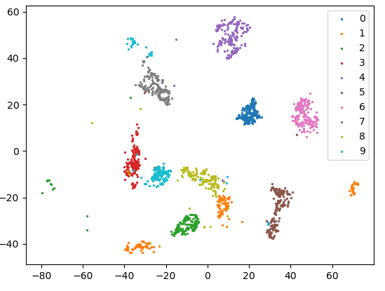

# Trimap

[Original repo](https://github.com/eamid/trimap)

Files:
 - trimap.h - the entire implementation
 - setup.sh - clones AnnoyLib. Run this first
 - prepare_mnist_data.py and mnist_data - Mnist data from SKLearn after running through PCA. This implementation does little data preprocessing, but the original article strongly suggests running PCA if the number of dimensions is high (>100). 
 - demo.py - usage example of the original implementation
 - test_mnist.cpp - usage example
 - plots.py - compares demo.py and test_mnist results

The result of running test_mnist and plots.py:

